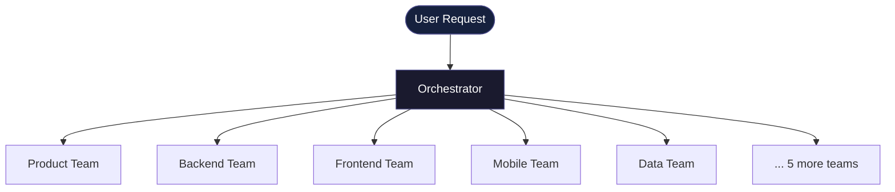

# AURORIE TEAMS

> Turn Claude Code into a fully-operational AI startup team in 60 seconds — with real artifacts.

⚡ 34 Agents · 10 Teams · 1 Orchestrator
⚡ Plug-and-play AI workflows for real-world execution
⚡ Built for builders, founders, and power users


**Languages:** English | [中文](README.zh.md)

---

## Install in 60 seconds

```bash
git clone https://github.com/aurorie-co/AURORIE-TEAMS.git /tmp/aurorie-teams
cd /path/to/your-project
/tmp/aurorie-teams/install.sh
```

Then just ask:

```
@orchestrator "Build me a SaaS product from scratch"
```

_(or simply: "Build me a SaaS product from scratch" — the system routes automatically)_

---

## 🎬 What it actually does

### Input

```
@orchestrator "Build a crypto trading dashboard with real-time data and mobile support"
```

### What happens internally

1. Orchestrator analyzes intent
2. Selects relevant teams:
   - Product Team  (requirements)
   - Backend Team  (API design)
   - Frontend Team (UI)
   - Mobile Team   (app structure)
3. Each team executes its workflow
4. Outputs are written to structured artifacts

### Output

```
.claude/workspace/
├── tasks/
│   └── task-001.json
└── artifacts/
    ├── product/prd.md
    ├── backend/api-design.md
    ├── frontend/ui-spec.md
    └── mobile/app-architecture.md
```

💡 You just went from idea → structured execution plan in seconds.

Each file is a reusable artifact — not just a response.

---

## 🧩 How it works

You don't interact with agents directly — the system does it for you:



Three layers:

1. **Orchestrator** — routes your request to the right teams
2. **Teams (10 domains)** — each specializes in a function
3. **Agents (34 total)** — each executes specific tasks with defined workflows

> ChatGPT → one smart person
> AURORIE TEAMS → a full company working together

_Want to see the full system? → See [Architecture](#-architecture) below._

---

## ⚡ Why not just use ChatGPT?

Because real work is not single-step.

| ChatGPT | AURORIE TEAMS |
|---------|---------------|
| One response | Multi-step execution |
| Generalist | Specialized teams |
| Ephemeral output | Structured artifacts |
| Manual thinking | Automated orchestration |

You don't need one answer.
You need a team that executes.

Ready to try it? ↓

---
