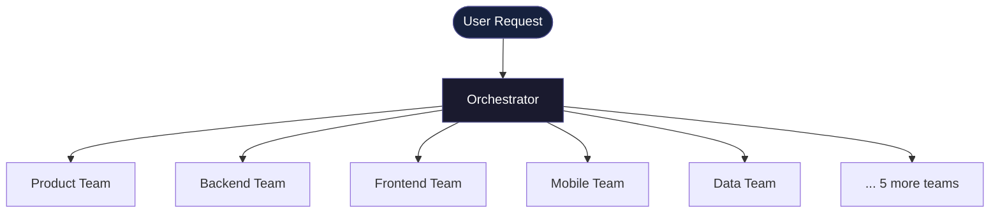
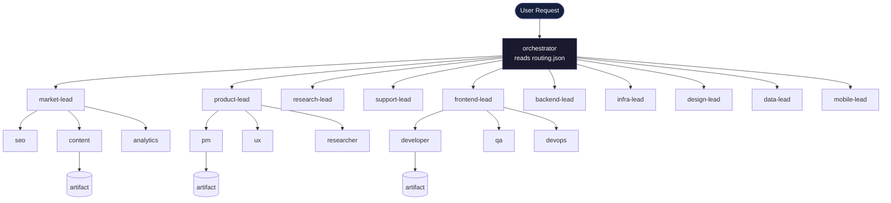

# AURORIE TEAMS

> 60 秒内，将 Claude Code 变成一支全功能 AI 创业团队——并产出真实文件。

⚡ 34 个 Agent · 10 个团队 · 1 个 Orchestrator
⚡ 即插即用的 AI 工作流，面向真实执行场景
⚡ 为构建者、创始人和高级用户而生


**语言：** [English](README.md) | 中文

---

- [60 秒安装](#60-秒安装)
- [实际效果](#-实际效果)
- [工作原理](#-工作原理)
- [为什么不直接用 ChatGPT？](#-为什么不直接用-chatgpt)
- [智能路由](#-智能路由)
- [系统架构](#-系统架构)
- [安装](#-安装)
- [试试这些 prompt](#-试试这些-prompt)
- [自定义](#-自定义)
- [安全说明](#️-安全说明)
- [路线图](#-路线图)
- [参与贡献](#-参与贡献)
- [测试](#测试)

---

## 60 秒安装

```bash
git clone https://github.com/aurorie-co/AURORIE-TEAMS.git /tmp/aurorie-teams
cd /path/to/your-project
/tmp/aurorie-teams/install.sh
```

然后直接说：

```
@orchestrator "Build me a SaaS product from scratch"
```

_（orchestrator 会读取 `.claude/routing.json` 自动分派团队）_

直接说你的任务——系统会自动路由到正确的团队。

---

## 🎬 实际效果

### 输入

```
@orchestrator "Build a crypto trading dashboard with real-time data and mobile support"
```

### 内部流程

1. Orchestrator 分析意图
2. 选择相关团队：
   - Product Team（需求）
   - Backend Team（服务与数据层）
   - Frontend Team（UI）
   - Mobile Team（App 结构）
3. 每个团队执行其工作流
4. 输出写入结构化产出文件

### 输出

```
.claude/workspace/
├── tasks/
│   └── <task-id>.json
└── artifacts/
    ├── product/<task-id>/
    │   ├── prd.md
    │   └── summary.md
    ├── backend/<task-id>/
    │   ├── backend-implementation.md
    │   └── summary.md
    ├── frontend/<task-id>/
    │   ├── frontend-implementation.md
    │   └── summary.md
    └── mobile/<task-id>/
        ├── ios-implementation.md
        └── summary.md
```

每个任务有独立的文件夹（UUID），产出文件不会相互覆盖。

💡 你刚刚在几秒内完成了从想法到结构化执行计划的全过程。

每个文件都是可复用的产出物——不只是一段对话回复。

---

## 🧩 工作原理

你不需要直接操控 Agent——系统会替你完成这一切：



三层架构：

1. **Orchestrator** — 将请求路由到正确的团队
2. **Teams（10 个领域）** — 每个团队专注于一个职能
3. **Agents（共 34 个）** — 每个 Agent 按定义的工作流执行具体任务

> ChatGPT → 一个聪明的人
> AURORIE TEAMS → 一整家公司协同工作

_想看完整系统架构？→ 查看下方[系统架构](#-系统架构)。_

---

## ⚡ 为什么不直接用 ChatGPT？

因为真实工作不是单步的。

| ChatGPT | AURORIE TEAMS |
|---------|---------------|
| 一个回答 | 多步执行 |
| 通才 | 专业团队 |
| 临时输出 | 结构化产出文件 |
| 手动思考 | 自动编排 |

你不需要一个答案。
你需要一支能执行的团队。

准备好试试了吗？↓

---

## 🧠 智能路由

每次路由决策都是可解释的——不是黑箱。

系统对每条团队规则进行打分：
- **+1**：每个 `positive_keywords` 命中
- **−2**：每个 `negative_keywords` 命中（强排除信号）

分数映射到置信度区间：
- **high**（≥ 3）→ 直接派发为主团队
- **medium**（≥ 1）→ 无 high 团队时作为主团队，否则作为"次要相关"展示
- **low / filtered**（< 1）→ 过滤掉，不派发

示例：

```
"Add a REST endpoint for user authentication with JWT"
→ backend: score 4, high → selected
→ product: score 1, medium → secondary（不派发）
→ market:  score -1, low  → filtered

"Build a SaaS platform with user requirements and API endpoints"
→ backend:   score 4, high   → selected
→ product:   score 2, medium → secondary
→ frontend:  score 1, medium → secondary
→ 其余团队:  low             → filtered
```

路由在规则层面是确定性的，在系统层面是自适应的。

你可以在 `.claude/routing.json` 中自定义路由规则，`routing_policy` 区块控制阈值。

### 调试路由决策

在任何 orchestrator 调用中加上 `--debug`，即可看到完整的路由过程：

```
@orchestrator --debug "Build a SaaS platform with user requirements and API endpoints"
```

输出示例：

```
=== ROUTING DEBUG ===

Policy:
- candidate_threshold: 1
- confidence.high: 3
- confidence.medium: 1
- dispatch_policy.high: auto
- dispatch_policy.medium.when_high_exists: ignore
- dispatch_policy.medium.when_no_high_exists: auto
- dispatch_strategy: conditional

Evaluations:
backend: score 4, high → selected
  + API, endpoint, SaaS, platform
  - (none)
product: score 2, medium → secondary
  + requirements, SaaS
  - (none)
market: score -1, low → filtered
  + (none)
  - iOS

Dispatch:
  Selected:  backend
  Secondary: product, frontend
  Ignored:   (none)
  Filtered:  market, mobile, data, ...

=== END ROUTING DEBUG ===
```

当触发 `ask` 模式时，还会额外显示 `Ask` 块，包含确认的团队和用户响应。

Debug 输出是 `routing_decision` 的纯投影——不会改变派发行为。

---

## 🕸 执行图（Execution Graph）

选中的团队并非总是扁平并行执行——v0.4 构建执行图，使团队按依赖顺序执行，独立节点并行运行。

**图模板（严格优先级，逐级匹配）：**

| 优先级 | 条件 | 模板 |
|--------|------|------|
| 1 | `data` 在选中团队中 | 数据优先链 |
| 2 | `research` 选中且无 `product` | 研究分支扇出 |
| 3 | `backend` 或 `frontend` 选中 | 线性流水线 |
| 4 | fallback | 扁平并行 |

**线性流水线示例** — `product → backend → frontend`：

```
Wave 1: product（立即就绪）
Wave 2: backend（product 完成后解锁）
Wave 3: frontend（backend 完成后解锁）
```

**研究分支** — `research → [backend, frontend]` 在 research 完成后并行执行。

**图运行时状态：** `pending` → `in_progress` → `completed` | `partial_failed`

图存储在任务 JSON 中（`routing_decision.execution_graph`）——不仅是执行计划，更是贯穿执行全过程的运行时对象。

---

## 🎯 Milestone — 跨任务协调层

v0.5 引入 milestone 作为跨任务的持久协调层，追踪跨 task、跨 graph、跨时间的目标进度。

**CLI：**

```
@orchestrator --milestone "Launch SaaS" "Build a crypto trading platform"
@orchestrator --milestone-status ms_abc123
```

**功能：**

- `--milestone "Title" "prompt"` — 将任务归入一个目标组。任务正常执行（routing + dispatch 不变），但附带 milestone 标签。Milestone 文件保存在 `.claude/workspace/milestones/<id>.json`。
- `--milestone-status <id>` — 查询 milestone，聚合所有已附着的任务状态，输出摘要：

```
Milestone: Launch SaaS (ms_abc123)
Status: in_progress
Tasks: 3 total
  - completed: 1
  - in_progress: 1
  - pending: 1
```

**状态聚合规则**（优先级）：
`partial_failed` > `in_progress` > `completed` > `pending`

**关键属性：**

| 属性 | 值 |
|------|-----|
| Schema | `.claude/workspace/milestones/<id>.json` |
| Task 引用 | `{milestone_id, title}` 嵌入 task JSON |
| 追加写入 | 任务只能添加，不能移除 |
| 对路由的影响 | 无 — milestone 是协调标签，不是路由信号 |
| 状态触发时机 | Task 创建时、`--milestone-status` 查询时 |

---

## 🏗 系统架构

完整系统如下：



每个团队包含：
- Agents（具有明确角色的 specialist）
- Workflows（逐步执行指南）
- Skills（可复用任务模块）
- MCP integrations（每个团队的工具访问权限）

---

## 🛠 安装

环境要求：macOS 或 Linux（bash 3.2+）· `jq` · `uuidgen` 或 `python3` · Node.js

```bash
# 1. 克隆库
git clone https://github.com/aurorie-co/AURORIE-TEAMS.git /tmp/aurorie-teams

# 2. 安装到你的项目
cd /path/to/your-project
/tmp/aurorie-teams/install.sh

# 3. 添加 API 密钥（可选但推荐）
export GITHUB_TOKEN=...
export EXA_API_KEY=...
export FIRECRAWL_API_KEY=...
export POSTGRES_URL=...

# 4. 验证
# 在 Claude Code 中：@orchestrator "Test the system"
# 你应该能看到路由 + 任务输出。
```

完成 ✅ 你的 Claude Code 现在已经是一支 AI 创业团队了。

### 安装参数

```
--force-workflows   覆盖本地已修改的 workflow 和 routing 文件
--yes               跳过所有确认提示
--detect-orphans    检测已不在仓库中的过时 agent/skill 文件
```

### 升级

```bash
git -C /tmp/aurorie-teams pull
cd /path/to/your-project && /tmp/aurorie-teams/install.sh
```

---

## 🧪 试试这些 prompt

每个 prompt 都会触发不同的团队工作流——试一个，看看系统如何运转。

### 构建产品 ⭐ 初次运行首选

```
@orchestrator "Create a SaaS for AI agents marketplace"
```

触发团队：
- Product Team
- Backend Team
- Frontend Team

输出：
```
.claude/workspace/artifacts/product/<task-id>/prd.md
.claude/workspace/artifacts/product/<task-id>/summary.md
.claude/workspace/artifacts/backend/<task-id>/backend-implementation.md
.claude/workspace/artifacts/backend/<task-id>/summary.md
.claude/workspace/artifacts/frontend/<task-id>/frontend-implementation.md
.claude/workspace/artifacts/frontend/<task-id>/summary.md
```

复制并运行——你会得到真实的产出文件。

---

### 分析数据

```
@orchestrator "Investigate why our DAU dropped 30% last week"
```

触发团队：
- Data Team
- Research Team

输出：
```
.claude/workspace/artifacts/data/<task-id>/analysis.md
.claude/workspace/artifacts/data/<task-id>/summary.md
.claude/workspace/artifacts/research/<task-id>/research-report.md
.claude/workspace/artifacts/research/<task-id>/summary.md
```

复制并运行——你会得到真实的产出文件。

---

### 构建 App

```
@orchestrator "Design a mobile app for habit tracking with iOS and Android support"
```

触发团队：
- Mobile Team
- Product Team

输出：
```
.claude/workspace/artifacts/mobile/<task-id>/ios-implementation.md
.claude/workspace/artifacts/mobile/<task-id>/android-implementation.md
.claude/workspace/artifacts/mobile/<task-id>/summary.md
.claude/workspace/artifacts/product/<task-id>/prd.md
.claude/workspace/artifacts/product/<task-id>/summary.md
```

复制并运行——你会得到真实的产出文件。

---

### 市场调研

```
@orchestrator "Compare the top 5 AI code generation tools — pricing, features, positioning"
```

触发团队：
- Research Team

输出：
```
.claude/workspace/artifacts/research/<task-id>/comparison-matrix.md
.claude/workspace/artifacts/research/<task-id>/summary.md
```

复制并运行——你会得到真实的产出文件。

---

### 构建交易系统

```
@orchestrator "Build a crypto SaaS with real-time price feeds, portfolio analytics, and a React dashboard"
```

触发团队：
- Product Team
- Backend Team
- Frontend Team
- Data Team

输出：
```
.claude/workspace/artifacts/product/<task-id>/prd.md
.claude/workspace/artifacts/product/<task-id>/summary.md
.claude/workspace/artifacts/backend/<task-id>/backend-implementation.md
.claude/workspace/artifacts/backend/<task-id>/summary.md
.claude/workspace/artifacts/frontend/<task-id>/frontend-implementation.md
.claude/workspace/artifacts/frontend/<task-id>/summary.md
.claude/workspace/artifacts/data/<task-id>/report-spec.md
.claude/workspace/artifacts/data/<task-id>/summary.md
```

复制并运行——你会得到真实的产出文件。

---

## 🔧 自定义

### 自定义行为
编辑 `.claude/workflows/<team>.md`，修改团队的运作方式。

### 自定义智能
编辑 `.claude/routing.json`——v2 schema 每条规则支持 `positive_keywords`（+1）、`negative_keywords`（−2）和 `example_requests`。

### 自定义工具
通过 `.claude/settings.json` 扩展 MCP 集成。

---

## ⚠️ 安全说明

尽量使用只读凭证。在执行任何操作前，请先审阅生成的产出文件。

### 详情

- **Agent 只生成输出——除非你主动触发，否则不会执行任何外部操作。**
  Agent 将文件写入 `.claude/workspace/artifacts/`。它们不会调用外部 API、
  运行 shell 命令或修改数据库，除非你明确接入这些能力。
  **默认行为是本地文件生成，输出目录为 `.claude/workspace/artifacts/`。**
- **没有你的确认，什么都不会执行。**
- 初始设置阶段，避免在生产系统上运行。
- 查看 `.claude/settings.json` 了解并控制每个 Agent 的工具访问权限。

---

## 🗺 路线图

我们在构建 AI 公司操作系统。

**v0.1 — 基础能力**
- ✓ 10 个专业团队，34 个 Agent
- ✓ 正负分值 v2 路由
- ✓ Lint + install 测试套件

**v0.2 — 可观测路由（当前版本）**
- ✓ 置信度路由（high / medium / filtered）
- ✓ 路由测试套件——5 个回归 case，集成 CI
- ✓ `--debug` flag——在终端输出完整的逐团队路由详情

**v0.3 — 可控执行**
- ✓ `dispatch_policy` 配置——routing.json 中按置信度控制派发行为
- ✓ `normalize_dispatch_policy`——纯函数，用 v0.2 等价默认值填充缺失键
- ✓ `apply_dispatch_policy`——Step 5.5 执行：auto / ignore / ask 三种模式
- ✓ Ask mode MVP——medium 置信度团队派发前交互确认（每轮最多一次）
- ✓ Dispatch policy 测试套件——47 个 case：normalize (4)、auto/ignore (4)、ask (5)、dry-run (5)、phase1 (14)、graph (15)
- ✓ `--dry-run` flag——计算路由但不派发团队
- ✓ `--debug --dry-run` 组合模式

**v0.5 — 目标导向协调运行时**（当前版本）

v0.5 引入跨任务的持久协调层。

- [x] **Milestone 系统**（已完成）
  - 跨任务和 graph 的持久协调层
  - 状态聚合：partial_failed > in_progress > completed > pending
  - 追加写入：任务只能添加，不能移除
  - CLI：`--milestone "title" "prompt"` 和 `--milestone-status <id>`
  - 纯函数：`lib/milestone.py` — 83/83 测试通过

- [x] **选择性路由**（已完成）
  - 决策范围：all | none | selective
  - `@orchestrator --resolve <task-id> selective backend,product`
  - 用户选择部分 medium 置信度团队确认
  - 空 selective → 等同于 decline；无效 team 名静默忽略

**v0.5：从任务编排走向目标导向协调。**

---

**v0.6 — 持久化执行运行时**（下一步）

v0.6 加入时间维度：使执行可回放、可续传。

- [ ] **Replay（回放）** — 查看历史决策和执行时间线
  - `@orchestrator --replay <task-id>`
  - 只读：展示 routing decision、execution graph、wave timeline、最终状态
  - 不修改任何状态
- [ ] **Resume（续传）** — 从中间状态继续 DAG 执行
  - `@orchestrator --resume <task-id>`
  - 加载 execution_graph；找到 pending / blocked / failed 节点；进入 Step C dispatch loop
  - 使 DAG 执行可中断、可恢复
- [ ] **执行轨迹基础**
  - 在 execution_graph 中加入结构化 `history[]`，用于审计和优化循环
  - 为未来：故障恢复、自动重试、行为学习铺路

**v0.6：让执行在时间维度上持久化——系统记住它做过什么，并能够继续。**

**长期 — AI 原生公司**
- [ ] 可观测性控制台
- [ ] Agent 市场
- [ ] 记忆系统
- [ ] 跨项目编排

---

## 🤝 参与贡献

我们在构建 AI 公司操作系统——而且我们对此有明确的主张。

欢迎贡献：
- 新增团队
- 优化路由逻辑
- 构建工作流
- 分享使用案例

我们重视一致性，而非数量。

请先阅读 [CONTRIBUTING.md](CONTRIBUTING.md)，再提交 PR 🚀

---

## 测试

`tests/` 目录中有四个测试套件：

| 脚本 | 测试内容 |
|--------|--------------|
| `tests/install.test.sh` | 完整安装生命周期：文件放置、路由保留、MCP 合并、孤立文件检测 |
| `tests/lint.test.sh` | 源码树一致性：Agent / 工作流 / 技能 / 路由契约验证 |
| `tests/routing/test_routing_cases.py` | 5 个确定性路由 case：置信度区间、派发、fallback、负关键词过滤 |
| `tests/routing/test_dispatch_policy.py` | 78 个 case：dispatch (47) + phase1+selective (20) + graph (15) + milestone (16) |

开 PR 或修改 routing/workflows 后，运行全部测试：

```bash
bash tests/install.test.sh && bash tests/lint.test.sh
```

也可单独运行：

```bash
python3 tests/routing/test_routing_cases.py
python3 tests/routing/test_dispatch_policy.py
```
